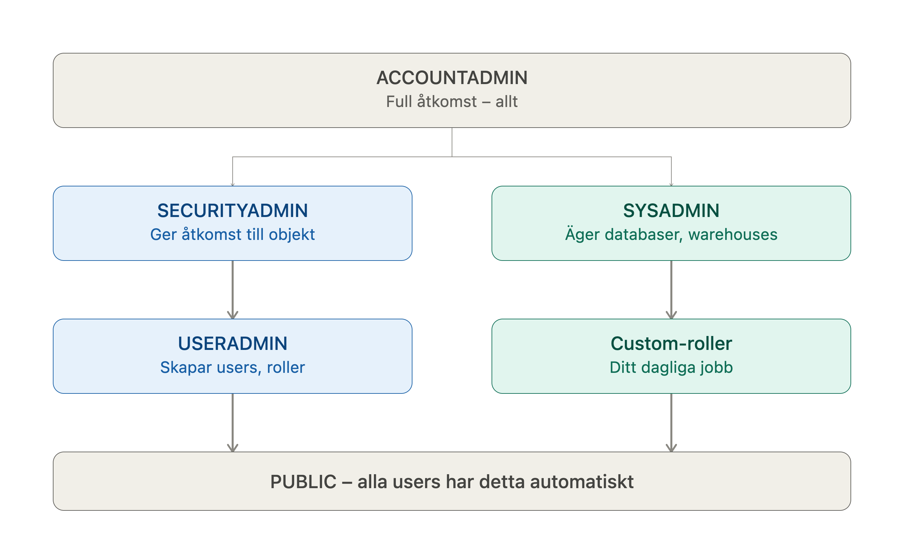

## Repo för kursen Dara Warehouse (Snowflake)

-- KONTOINFORMATION
-- Visa nuvarande region
SELECT CURRENT_REGION();

-- Visa nuvarande konto och organisation
SELECT CURRENT_ACCOUNT(), CURRENT_ORGANIZATION_NAME();

-- Visa nuvarande roll, warehouse, databas och schema
SELECT CURRENT_ROLE(), CURRENT_WAREHOUSE(), CURRENT_DATABASE(), CURRENT_SCHEMA();

-- Visa Snowflake-version (klient/servervarning)
SELECT CURRENT_VERSION();

-- Visa aktuell användare
SELECT CURRENT_USER();


-- EDITION OCH KONTOÖVERSIKT (kräver ACCOUNTADMIN eller motsvarande rättigheter)
-- Lista alla konton i organisationen med edition, region m.m.
SHOW ORGANIZATION ACCOUNTS;

-- Alternativ: detaljerad kontoinfo via ACCOUNT_USAGE
SELECT ACCOUNT_NAME, EDITION, REGION, CREATED_ON
FROM SNOWFLAKE.ORGANIZATION_USAGE.ACCOUNTS;


-- CREDIT-FÖRBRUKNING
-- Totalt antal credits förbrukade (alla tider, i ACCOUNT_USAGE-schemat)
SELECT SUM(CREDITS_USED) AS TOTAL_CREDITS
FROM SNOWFLAKE.ACCOUNT_USAGE.METERING_HISTORY;

-- Credits förbrukade per dag, senaste 30 dagarna
SELECT TO_DATE(START_TIME) AS USAGE_DATE, SUM(CREDITS_USED) AS DAILY_CREDITS
FROM SNOWFLAKE.ACCOUNT_USAGE.METERING_HISTORY
WHERE START_TIME >= DATEADD('day', -30, CURRENT_TIMESTAMP())
GROUP BY USAGE_DATE
ORDER BY USAGE_DATE;

-- Credits förbrukade per warehouse
SELECT WAREHOUSE_NAME, SUM(CREDITS_USED) AS TOTAL_CREDITS
FROM SNOWFLAKE.ACCOUNT_USAGE.WAREHOUSE_METERING_HISTORY
GROUP BY WAREHOUSE_NAME
ORDER BY TOTAL_CREDITS DESC;


-- ÖVRIGT ANVÄNDBART
-- Lista alla warehouses i kontot
SHOW WAREHOUSES;

-- Lista alla databaser
SHOW DATABASES;

-- Visa parametrar för kontot (t.ex. inställningar kring auto-suspend etc.)
SHOW PARAMETERS IN ACCOUNT;

# Snowflake – Systemroller och användningsområden

| Roll | Rättigheter / ansvar | När du bör använda den |
|---|---|---|
| **ACCOUNTADMIN** | Toppnivårollen. Har alla rättigheter i hela kontot, inklusive fakturering, säkerhet och alla objekt. Ärver från SYSADMIN och SECURITYADMIN. | Endast för initial kontokonfiguration, fakturering/billing-inställningar, eller absoluta undantagsfall. **Bör aldrig användas för dagligt arbete** — för hög risk och bryter mot PoLP. |
| **SECURITYADMIN** | Hanterar säkerhet: skapa/hantera roller (ärver från USERADMIN), bevilja/återkalla rättigheter globalt (`MANAGE GRANTS`), hantera nätverkspolicyer. | När du ska koppla roller till användare (`GRANT ROLE ... TO USER ...`), eller hantera säkerhetsrelaterade inställningar som inte rör ägande av data-/compute-objekt. |
| **USERADMIN** | Skapar och hanterar användare och roller (men inte grants på data-objekt). Ärver till SECURITYADMIN. | När du ska skapa nya användare (`CREATE USER`) eller nya roller (`CREATE ROLE`), innan rollen kopplas till rättigheter eller användare. |
| **SYSADMIN** | Skapar och äger databaser, scheman, tabeller och warehouses. Vanligtvis den roll som ger ut rättigheter på objekt den själv äger. | Standardrollen för att skapa och hantera warehouses, databaser, scheman och andra dataobjekt, samt bevilja rättigheter på dessa till anpassade roller. |
| **PUBLIC** | Automatisk roll som alla användare och roller tillhör. Har normalt minimala/inga rättigheter som standard. | Använd endast om du medvetet vill ge åtkomst till *alla* i kontot — annars undvik att bevilja rättigheter hit. |
| **Anpassade roller** (t.ex. `marketing_dlt_role`) | Skapas av USERADMIN, får specifika rättigheter tilldelade av SYSADMIN (eller ägaren av objekten), tilldelas sedan till specifika användare via SECURITYADMIN. | Skapa alltid en egen roll per funktion/team/pipeline (t.ex. en roll för dlt-laddning, en för BI-verktyg) istället för att återanvända systemrollerna direkt — detta är kärnan i PoLP. |

## Typiskt rollflöde vid uppsättning (PoLP)

1. **USERADMIN** → skapar rollen (`CREATE ROLE`) och/eller användaren (`CREATE USER`)
2. **SYSADMIN** → skapar databaser/scheman/warehouses och beviljar rättigheter på dem till den nya rollen (`GRANT ... ON ... TO ROLE ...`)
3. **SECURITYADMIN** → kopplar rollen till användaren (`GRANT ROLE ... TO USER ...`)

## Minnesregel

- **USERADMIN** = vem (användare och roller)
- **SYSADMIN** = vad (databaser, scheman, warehouses, rättigheter på dem)
- **SECURITYADMIN** = koppla ihop vem och vad (roll ↔ användare)
- **ACCOUNTADMIN** = nödutgång, används sällan




# To work with dlt & dlthub
#### 1.To upgrade the uv environment
```bash
pip install --upgrade uv
```
#### 2. To create the virual environment
bash ```
uv init --no-package --python 3.13
```
#### 3. To install dependencies
bash ```
uv add "dlt[snowflake]" "dlt[parquet]" pandas ipykenel
```

*To setup dbt:*
```bash
uv add dbt-core dbt-snowflake
```
*cd into correct folder*
```bash
dbt init dbt_code
```
*Note: to find account:*
USE ROLE ORGADMIN;
SHOW ACCOUNTS;
copy 'account_locator_url' (delete this part 'https://....snowflakecomputing.com')

*To create profiles.yml on Windows*
```bash
New-Item -ItemType Directory -Force -Path "$HOME\.dbt"
code "$HOME\.dbt\profiles.yml"
```

*Navigate to dbt-folder and debug:*
```bash
cd 09_setup_dbt/dbt_code
dbt debug
```


