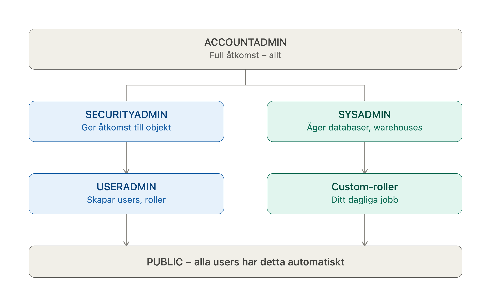
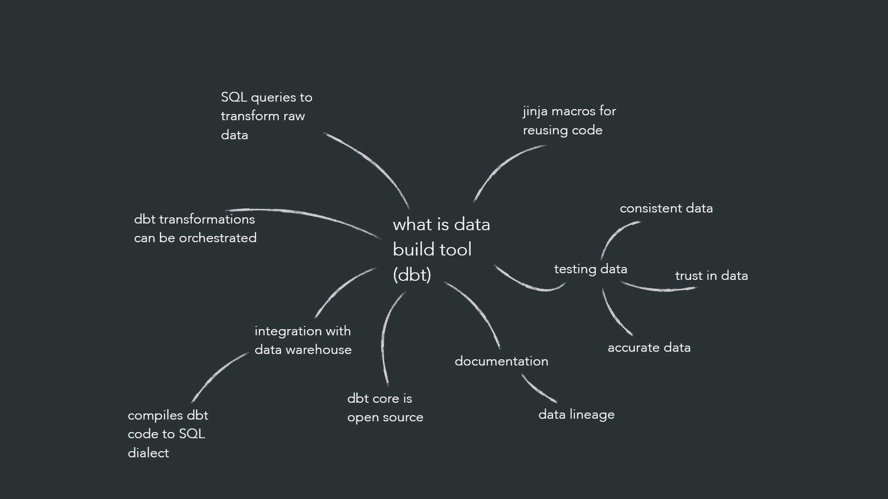
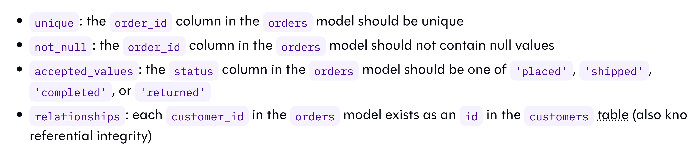
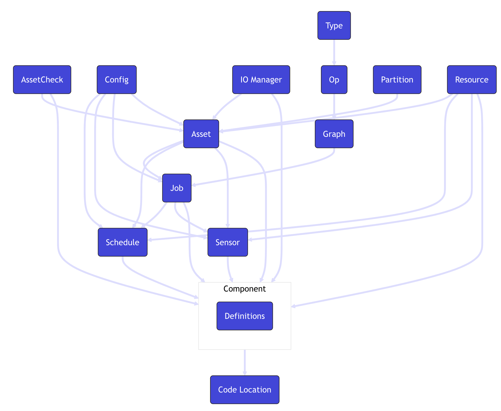

# Kursanteckningar: Data Warehouse (Snowflake)

## Innehåll
- [Snowflake: kontoinfo och credits](#snowflake-kontoinfo-och-credits)
- [05. Users och Roles (Snowflake)](#05-users-och-roles-snowflake)
- [06–08. dlt (Data Load Tool)](#0608-dlt-data-load-tool)
- [09. Setup dbt](#09-setup-dbt)
- [10. dbt modeling](#10-dbt-modeling)
- [11. Testing i dbt](#11-testing-i-dbt)
- [12. Dashboard i Streamlit](#12-dashboard-i-streamlit-koppla-dbt-till-streamlit)
- [13. dbt documentation](#13-dbt-documentation)
- [14. Orkestrering med Dagster](#14-orkestrering-med-dagster)

---

## Snowflake: kontoinfo och credits

### Kontoinformation
```sql
-- Visa nuvarande region
SELECT CURRENT_REGION();

-- Visa nuvarande konto och organisation
SELECT CURRENT_ACCOUNT(), CURRENT_ORGANIZATION_NAME();

-- Visa nuvarande roll, warehouse, databas och schema
SELECT CURRENT_ROLE(), CURRENT_WAREHOUSE(), CURRENT_DATABASE(), CURRENT_SCHEMA();

-- Visa Snowflake-version (klient/servervarning)
SELECT CURRENT_VERSION();

-- Visa aktuell användare
SELECT CURRENT_USER();
```

### Edition och kontoöversikt
Kräver ACCOUNTADMIN eller motsvarande rättigheter.

```sql
-- Lista alla konton i organisationen med edition, region m.m.
SHOW ORGANIZATION ACCOUNTS;

-- Alternativ: detaljerad kontoinfo via ACCOUNT_USAGE
SELECT ACCOUNT_NAME, EDITION, REGION, CREATED_ON
FROM SNOWFLAKE.ORGANIZATION_USAGE.ACCOUNTS;
```

### Credit-förbrukning
```sql
-- Totalt antal credits förbrukade (alla tider, i ACCOUNT_USAGE-schemat)
SELECT SUM(CREDITS_USED) AS TOTAL_CREDITS
FROM SNOWFLAKE.ACCOUNT_USAGE.METERING_HISTORY;

-- Credits förbrukade per dag, senaste 30 dagarna
SELECT TO_DATE(START_TIME) AS USAGE_DATE, SUM(CREDITS_USED) AS DAILY_CREDITS
FROM SNOWFLAKE.ACCOUNT_USAGE.METERING_HISTORY
WHERE START_TIME >= DATEADD('day', -30, CURRENT_TIMESTAMP())
GROUP BY USAGE_DATE
ORDER BY USAGE_DATE;

-- Credits förbrukade per warehouse
SELECT WAREHOUSE_NAME, SUM(CREDITS_USED) AS TOTAL_CREDITS
FROM SNOWFLAKE.ACCOUNT_USAGE.WAREHOUSE_METERING_HISTORY
GROUP BY WAREHOUSE_NAME
ORDER BY TOTAL_CREDITS DESC;
```

### Övrigt användbart
```sql
-- Lista alla warehouses i kontot
SHOW WAREHOUSES;

-- Lista alla databaser
SHOW DATABASES;

-- Visa parametrar för kontot (t.ex. inställningar kring auto-suspend etc.)
SHOW PARAMETERS IN ACCOUNT;
```

---

## 05. Users och Roles (Snowflake)

### Varför?
- För att samarbeta och hantera säkerhet med users och roles i Snowflake.

### Access control i Snowflake
Snowflake använder två modeller för åtkomstkontroll:

- **DAC (Discretionary Access Control)**
    - Varje objekt har en ägare (owner).
    - Ägaren kan bevilja (grant) privilegier till andra så att de får åtkomst till objektet.
- **RBAC (Role-Based Access Control)**
    - Åtkomsträttigheter (privileges) tilldelas roller, inte direkt till användare.
    - Roller tilldelas i sin tur till users och till andra roller (roller kan ärva från varandra).

**Exempel – Learnpoint (rättighet = privilege):**
- **Elvin – UL-roll**
    - Rättighet att lägga till kurser
    - Rättighet att redigera studentinfo
- **Debbie – Teacher-roll**
    - Rättighet att sätta betyg
    - Rättighet att ladda upp läxor
- **Vi – Student-roll**
    - Rättighet att lämna in uppgifter

#### Skillnad mellan Role och User
- **Role** – själva rollen, t.ex. "Teacher".
- **User** – en fysisk person, t.ex. "Debbie".

#### Privilegier ärvs
- Roller kan GRANTas (beviljas) till olika users.
- Privilegier ärvs beroende på hur mycket åtkomst en roll eller user ska ha (en roll högre upp i hierarkin ärver rättigheterna från rollerna under sig).

### Systemdefinierade roller (system-defined roles)

Snowflake har ett antal inbyggda roller med olika ansvarsområden:

#### ORGADMIN
- Hanterar operationer på **organisationsnivå** (över flera Snowflake-konton).
- Kan skapa nya konton inom organisationen.
- Ligger utanför den vanliga roll-hierarkin för ett enskilt konto.

#### ACCOUNTADMIN
- Den högsta rollen **inom ett konto**.
- Bör bara tilldelas ett fåtal betrodda användare.
- Kombinerar rättigheterna från SYSADMIN och SECURITYADMIN.

#### SECURITYADMIN
- Hanterar grants (beviljanden av rättigheter) globalt i kontot.
- Kan bevilja/återkalla åtkomst till objekt även om personen själv inte äger objektet.
- Kan alltså hantera *vem som får access*, men får inte nödvändigtvis använda objektet själv.
- Ärver rättigheterna från USERADMIN.

#### SYSADMIN
- Kan skapa warehouses.
- Kan skapa databaser.
- Kan skapa övriga objekt (scheman, tabeller m.m.).
- Rekommenderas som roll för att äga de flesta databasobjekt.

#### USERADMIN
- Hanterar users och roller.
- Används för att skapa nya users och roller.

#### PUBLIC
- En roll som automatiskt tilldelas alla users.
- Objekt som ägs av PUBLIC är tillgängliga för alla.

### Hierarki av roller och ärvda privilegier

Hierarkin ser ut ungefär så här (uppifrån och ned):

```
ACCOUNTADMIN
   ├── SYSADMIN
   └── SECURITYADMIN
            └── USERADMIN
                    └── PUBLIC
```

- **ACCOUNTADMIN** – toppen, ärver från både SYSADMIN och SECURITYADMIN.
- **SYSADMIN** – objektadministratör (databaser, warehouses osv.), egen gren.
- **SECURITYADMIN** – hanterar grants globalt, egen gren.
- **USERADMIN** – skapar users, ligger under SECURITYADMIN.
- **PUBLIC** – längst ned, alla users har den automatiskt.

*Obs: ORGADMIN ingår inte i denna hierarki eftersom den verkar på organisationsnivå, ovanför de enskilda kontona.*

Läs mer: https://docs.snowflake.com/en/user-guide/security-access-control-considerations#example



### Sammanfattning: systemroller och användningsområden

| Roll | Rättigheter / ansvar | När du bör använda den |
|---|---|---|
| **ACCOUNTADMIN** | Toppnivårollen. Har alla rättigheter i hela kontot, inklusive fakturering, säkerhet och alla objekt. Ärver från SYSADMIN och SECURITYADMIN. | Endast för initial kontokonfiguration, fakturering/billing-inställningar, eller absoluta undantagsfall. **Bör aldrig användas för dagligt arbete**, för hög risk och bryter mot PoLP. |
| **SECURITYADMIN** | Hanterar säkerhet: skapa/hantera roller (ärver från USERADMIN), bevilja/återkalla rättigheter globalt (`MANAGE GRANTS`), hantera nätverkspolicyer. | När du ska koppla roller till användare (`GRANT ROLE ... TO USER ...`), eller hantera säkerhetsrelaterade inställningar som inte rör ägande av data-/compute-objekt. |
| **USERADMIN** | Skapar och hanterar användare och roller (men inte grants på data-objekt). Ärver till SECURITYADMIN. | När du ska skapa nya användare (`CREATE USER`) eller nya roller (`CREATE ROLE`), innan rollen kopplas till rättigheter eller användare. |
| **SYSADMIN** | Skapar och äger databaser, scheman, tabeller och warehouses. Vanligtvis den roll som ger ut rättigheter på objekt den själv äger. | Standardrollen för att skapa och hantera warehouses, databaser, scheman och andra dataobjekt, samt bevilja rättigheter på dessa till anpassade roller. |
| **PUBLIC** | Automatisk roll som alla användare och roller tillhör. Har normalt minimala/inga rättigheter som standard. | Använd endast om du medvetet vill ge åtkomst till *alla* i kontot, annars undvik att bevilja rättigheter hit. |
| **Anpassade roller** (t.ex. `marketing_dlt_role`) | Skapas av USERADMIN, får specifika rättigheter tilldelade av SYSADMIN (eller ägaren av objekten), tilldelas sedan till specifika användare via SECURITYADMIN. | Skapa alltid en egen roll per funktion/team/pipeline (t.ex. en roll för dlt-laddning, en för BI-verktyg) istället för att återanvända systemrollerna direkt. Detta är kärnan i PoLP. |

#### Typiskt rollflöde vid uppsättning (PoLP)

1. **USERADMIN** → skapar rollen (`CREATE ROLE`) och/eller användaren (`CREATE USER`)
2. **SYSADMIN** → skapar databaser/scheman/warehouses och beviljar rättigheter på dem till den nya rollen (`GRANT ... ON ... TO ROLE ...`)
3. **SECURITYADMIN** → kopplar rollen till användaren (`GRANT ROLE ... TO USER ...`)

#### Minnesregel

- **USERADMIN** = vem (användare och roller)
- **SYSADMIN** = vad (databaser, scheman, warehouses, rättigheter på dem)
- **SECURITYADMIN** = koppla ihop vem och vad (roll ↔ användare)
- **ACCOUNTADMIN** = nödutgång, används sällan

---

## 06–08. dlt (Data Load Tool)

### dlthub
- **dlt** (data load tool) är ett Python-bibliotek för att ladda in data (t.ex. från API:er eller filer) till en destination, som en del av staging-lagret i en data-pipeline.

### Setup av dlt (dlthub)

1. Uppgradera `uv`:
```bash
pip install --upgrade uv
```

2. Skapa den virtuella miljön:
```bash
uv init --no-package --python 3.13
```

3. Installera beroenden:
```bash
uv add "dlt[snowflake]" "dlt[parquet]" pandas ipykernel
```

### Varför behöver vi secrets.toml?
- dlt läser inloggningsuppgifter (t.ex. user, password, account) från en `.dlt/secrets.toml`-fil.
- Detta gör att man slipper hårdkoda känsliga uppgifter i koden. De hålls separata och kan enkelt bytas ut eller hållas utanför versionshantering (t.ex. via `.gitignore`).

---

## 09. Setup dbt

### 1. Installera beroenden
```bash
uv add dbt-core dbt-snowflake
```
- **dbt-core** – själva open source-verktyget/kommandoradsverktyget som gör transformeringarna. (Detta är *inte* samma sak som dbt Cloud, som är ett separat betalt SaaS-verktyg med bland annat webb-UI och schemaläggning.)
- **dbt-snowflake** – adapter/plugin som gör att dbt-core kan koppla upp sig mot och köra kod i Snowflake (destinationen).

Installera även VS Code-tillägget **dbt Power User**.

### 2. Sätt upp mappstrukturen
Gå in i rätt mapp och initiera dbt:
```bash
dbt init dbt_code
```
*(Detta genererar dbt-mapparna och du fyller i uppkopplingsuppgifter till Snowflake – warehouse, database, m.m. – i samband med detta.)*

**Hitta ditt account:** kör följande i Snowflake och kopiera `account_locator_url`. Ta bort delen `https://....snowflakecomputing.com`, så att bara själva account-identifieraren återstår.
```sql
USE ROLE ORGADMIN;
SHOW ACCOUNTS;
```

### 3. Skapa och öppna `profiles.yml` på Windows
Om den inte redan skapades av `dbt init`, eller om du vill sätta upp den manuellt:
```bash
New-Item -ItemType Directory -Force -Path "$HOME\.dbt"
```
```bash
code "$HOME\.dbt\profiles.yml"
```
*Alternativ:*
- Ctrl+P i VS Code och sök på "profiles"
- eller hitta filen manuellt via utforskaren (`.dbt`-mappen i din hemkatalog)

### 4. Kontrollera uppsättningen
Gå till dbt-mappen och kör debug. Förhoppningsvis får du **All checks passed**:
```bash
cd 09_setup_dbt/dbt_code
dbt debug
```

Installera dbt-paket:
```bash
dbt deps
```

### Mappar och filer i dbt (genereras av `dbt init`)

| Mapp / fil | Beskrivning |
|---|---|
| **models** | Här ligger dina SQL-filer för datatransformering, kärnan i dbt-projektet. |
| **seeds** | CSV-filer med statisk referensdata som dbt laddar in direkt som tabeller i databasen (t.ex. landskoder eller andra sällan-ändrade lookup-tabeller). Körs *inte* genom samma transformeringslogik som models. |
| **snapshots** | Standardmappen där dbt sparar filer som används för att spåra historiska dataförändringar över tid, med hjälp av Type 2 Slowly Changing Dimensions (SCD). |
| **tests** | Innehåller tester som kontrollerar att data i Snowflake ser ut som förväntat (t.ex. unika värden, inga null-värden). Egna tester skrivs här. |
| **logs** | Sparar loggfiler från dbt-körningar (t.ex. `dbt run`), bra för felsökning. |
| **analyses** | SQL-filer för analys/ad-hoc-frågor (EDA) som kompileras av dbt men *inte* körs eller materialiseras som models. |
| **macros** | "Funktioner" i dbt, skrivna med Jinja. Återanvändbar SQL-logik som kan anropas från flera models (DRY). |
| **target** | Kompilerad SQL som dbt genererar genom att kombinera model-filer, macros och konfiguration. |
| **docs** | Markdown-filer för att dokumentera dbt-projektet, kan renderas i dbt-dokumentationen. |
| **schema.yml** | Definierar tester, dokumentation och relationer för models, seeds och sources. |
| **dbt_project.yml** | Huvudkonfigurationsfilen för hela dbt-projektet (namn, version, sökvägar, materialiseringsinställningar per mapp, m.m.). |
| **profiles.yml** (`~/.dbt/`) | Innehåller uppkopplingsuppgifter (credentials) till databasen. Man kan ha flera profiler i samma fil om man behöver flera uppsättningar (t.ex. dev/prod). **Var försiktig: om du skriver över filen förlorar du dina sparade credentials.** |

Bra källor:
- https://medium.com/@likkilaxminarayana/6-dbt-project-structure-explained-a-practical-guide-for-analytics-engineers-5894f6230756
- https://docs.getdbt.com/category/project-configs?version=2

### profiles.yml (exempel)
```yaml
dbt_snowflake:
  outputs:
    dev:
      account: ------
      client_session_keep_alive: false
      database: job_ads
      password: -----
      role: job_ads_dbt_role
      schema: staging
      type: snowflake
      user: transformer
      warehouse: dev_wh
  target: dev
```

### dbt_project.yml (exempel, med förklaring)
```yaml
# Namnge ditt projekt! Projektnamn ska bara innehålla gemener och
# understreck. Ett bra namn speglar er organisation eller
# syftet med dessa models.
name: 'dbt_code'
version: '1.4.1'

# Denna inställning styr vilken "profil" (från profiles.yml) dbt
# använder för det här projektet.
profile: 'dbt_snowflake'

# Dessa inställningar anger var dbt ska leta efter olika typer av
# filer. `model-paths` anger t.ex. att models i projektet finns i
# mappen "models/". Behöver oftast inte ändras.
model-paths: ["models"]
analysis-paths: ["analyses"]
test-paths: ["tests"]
seed-paths: ["seeds"]
macro-paths: ["macros"]
snapshot-paths: ["snapshots"]

clean-targets:         # mappar som tas bort av `dbt clean`
  - "target"
  - "dbt_packages"

models:
  dbt_code:
    staging:
      schema: staging
      materialized: table   # skapas som en fysisk tabell i staging-schemat
    refined:
      schema: warehouse
      materialized: table   # skapas som en fysisk tabell i warehouse-schemat
```

**Förklaring:** `models`-blocket i `dbt_project.yml` låter dig sätta standardinställningar per mapp/lager i ditt projekt, t.ex. vilket schema modellerna ska hamna i och hur de ska materialiseras (som `table`, `view`, `incremental` osv.). Här är `staging`-modeller konfigurerade att hamna i schemat `staging`, och `refined`-modeller i schemat `warehouse`, båda materialiserade som tabeller.

### Köra
```bash
cd /dbt_code
dbt run
```
Gå till Snowflake-katalogen och kolla att rätt schema och tabeller ligger där.

### Vad är dbt?


---

## 10. dbt modeling

### 1. Skapa ny dbt-mappstruktur
```bash
cd 10_dbt_modeling
dbt init dbt_code
```
`dbt init` initierar ett nytt dbt-projekt i undermappen `dbt_code` och frågar interaktivt efter uppkopplingsuppgifter till Snowflake.

> Svara att den **inte** ska skrivas över, så att du återanvänder samma uppkopplingsuppgifter som i tidigare övningar.

Återanvänd samma profil (`dbt_snowflake`) i `profiles.yml` som i tidigare lektioner, istället för att skapa en helt ny.

### 2. Städa mappstrukturen
Ta bort mappar/filer som inte används i just detta projekt (t.ex. `README.md`, `.gitignore`, `snapshots` om ni inte snapshot:ar).

- **Kom ihåg att kopiera innehållet från dbt:s genererade `.gitignore` till rotmappens `.gitignore`**, så att t.ex. `target/`, `dbt_packages/` och `logs/` ignoreras även på projektnivå (annars riskerar du samma "allt är rött i git"-problem som tidigare).
- I `macros/`-mappen: ta bort `.gitkeep`-filen. Den filen finns bara för att git ska spåra en annars tom mapp och behövs inte längre när mappen innehåller riktiga macro-filer.

### 3. Macros: generate_schema_name och string_utils

#### generate_schema_name.sql
Skriver över dbt:s standardbeteende, som annars slår ihop profilens schema med modellens `+schema` (t.ex. `staging_warehouse`). Med denna macro används istället bara modellens eget `+schema`-namn rakt av (t.ex. bara `warehouse`), vilket ger renare och mer förutsägbara schemanamn i Snowflake.

```sql

    
    
        {{ default_schema }}
    
        {{ custom_schema_name | trim }}
    

```

#### string_utils.sql – capitalize_first_letter
En egen macro som formaterar text till "Stor bokstav först, resten litet" (t.ex. `"MALMÖ"` → `"Malmö"`), återanvändbar i valfri modell istället för att skriva samma `case when`-logik flera gånger.

```sql

    case
        when {{ column }} is null
        then null
        else upper(substr({{ column }}, 1, 1)) || lower(substr({{ column }}, 2))
    end

```

### 4. dbt_project.yml – konfigurera mapparna
Lägg till mapparna (`src`, `dim`, `fct`, `mart`) under `models:` och sätt `+schema` och `+materialized` (t.ex. `view` eller `table`) för var och en.

#### Förklaring
Tänk dig att `dbt_project.yml` är en regellista för mapparna i din `models/`-katalog. Istället för att bestämma i varje SQL-fil hur den ska byggas, säger du det en gång per mapp.

**Vad raderna betyder:**

| Rad | Betydelse |
|---|---|
| `+materialized: table` | "Bygg allt som en riktig tabell i databasen." |
| `+schema: ...` | "Lägg tabellen i det här schemat i databasen." (Ett schema är som en mapp i databasen.) |
| `+materialized: ephemeral` | "Bygg ingen tabell alls, använd bara koden som en tillfällig mellanrutin (klistras in som en CTE i modeller som refererar till den)." |

**Config i klartext:**

| Mapp i `models/` | Materialisering | Schema | Vad händer med SQL-filerna där |
|---|---|---|---|
| `src/` | `ephemeral` | `staging` | Blir ingen egen tabell/view i Snowflake; koden klistras in i modeller som gör `ref()` till den. |
| `dim/` | `table` | `warehouse` | Blir tabeller i `warehouse` |
| `fct/` | `table` | `warehouse` | Blir tabeller i `warehouse` |
| `mart/` | `table` | `marts` | Blir tabeller i `marts` |

> ⚠️ **Kom ihåg:** i en tidigare lektion användes schemat `mart` (singular) och du fick av misstag två parallella scheman (`mart` och `marts`) med samma tabell, vilket du fick städa bort manuellt. Se till att du är konsekvent med vilket namn (`mart` eller `marts`) du använder i det här projektet, så att du inte återskapar samma dubblett.

**Kopplingen till models:** Mappnamnen i YAML-filen (`src`, `dim`, `fct`, `mart`) är samma namn som mapparna i din `models/`-katalog. En SQL-fil som ligger i `models/dim/` får automatiskt reglerna under `dim:`. Ligger en fil i `models/dim/kunder.sql` blir den alltså en tabell i schemat `warehouse`, utan att du skrivit något om det i själva filen.

**Plustecknet:** `+` betyder "det här är en inställning". Utan `+` är det ett mappnamn. Därför är `src` en mapp, men `+schema` en inställning.

### 5. packages.yml – dbt_utils

> Filen ska heta **`packages.yml`** (plural), inte `package.yml`. Ett felstavat filnamn gör att dbt inte hittar den, och `dbt deps` har inget att installera.

```yaml
packages:
  - package: dbt-labs/dbt_utils
    version: 1.4.1
```

`dbt_utils` är ett tillägg med färdiga, testade SQL-hjälpfunktioner (macros) för vanliga behov i dbt-projekt, så man slipper återuppfinna hjulet. Vi använder den framför allt för `generate_surrogate_key()`, som skapar de unika ID:na (t.ex. `occupation_id`, `employer_id`) i våra dimensionstabeller.

Installera beroenden (i dbt-mappen för projektet):
```bash
cd 10_dbt_modeling/dbt_code
dbt deps
```

Kör därefter:
```bash
dbt debug
```
för att bekräfta att anslutningen och projektet är korrekt konfigurerat, innan du börjar bygga modeller.

### Varför använda src?

#### sources.yml
```yaml
# Rådatatabellen.
# Berättar för dbt att det finns en tabell skapad av dlt (rådatan),
# som dbt själv inte äger eller bygger.
sources:
  - name: job_ads          # alias att använda i koden
    schema: staging
    tables:
      - name: stg_ads
        identifier: technical_field_job_ads   # det riktiga tabellnamnet i Snowflake
```

#### t.ex. i src_job_ads
```sql
-- this is an extract of the model
-- funkar tack vare Jinja-templating (dubbla måsvingar {{ }})
-- with <alias> as (select allt från <source_name>.<table_name> enligt sources.yml)
with stg_job_ads as (select * from {{ source('job_ads', 'stg_ads') }})

-- gör inga större transformeringar i src-lagret – det är till för att
-- plocka ut och döpa om relevanta kolumner, inte för affärslogik
select
    OCCUPATION__LABEL as occupation_label,
    headline,
    NUMBER_OF_VACANCIES as vacancies,
    RELEVANCE,
    APPLICATION_DEADLINE
from stg_job_ads   -- aliaset som valdes i with-satsen
```

**Vad händer här?**
En modell som med `with` skapar ett alias (valfritt namn) för att hämta rådata via `sources.yml`, och sedan plockar ut och döper om de kolumner man vill jobba vidare med. Downstream-modeller (dim/fct) refererar sedan till *src-modellen* via `ref()`, istället för att varje modell behöver känna till hela den råa källtabellen. Det gör koden enklare att läsa och att underhålla, eftersom döpnings- och urvalslogiken bara finns på ett ställe.

#### Senare, i models/fct/fct_job_ads
```sql
-- with <nytt alias> as (select allt, referera till src-aliaset via ref())
with job_ads as (select * from {{ ref('src_job_ads') }})

select
    {{ dbt_utils.generate_surrogate_key(['occupation_label']) }} as occupation_id,
    vacancies,
    relevance,
    application_deadline
from job_ads
```

Här skapas surrogatnyckeln `occupation_id` genom att hasha `occupation_label`. Det är **inte** nyckeln i sig som kopplar ihop tabellerna, utan det faktum att `dim_occupation` räknar fram exakt samma hash (samma kolumn, samma värde) för samma yrke. Eftersom båda sidor gör identisk hashning kan de sedan joinas ihop på `occupation_id`. I den här modellen görs ingen aggregering (`max`/`min`), eftersom `fct_job_ads` ska ha en rad per annons. Aggregering med `max()`/`min()` används istället i dim-modellerna, där flera rader (annonser) ska slås ihop till en rad per unikt värde (t.ex. per yrke eller arbetsgivare).

---

## 11. Testing i dbt

Tester i dbt används för att kontrollera att datan och transformationerna håller rätt kvalitet. Ett test är en SQL-fråga som letar efter rader som **bryter mot** ett antagande. Om frågan returnerar 0 rader går testet igenom, annars misslyckas det.

### Generiska tester (generic data tests)

Generiska tester definieras i `schema.yml` (eller valfri `.yml`-fil) under respektive modell och kolumn. Se filen för exempel på hur det kan se ut.



dbt har **4 inbyggda generiska tester**:

| Test              | Vad det kontrollerar                                                  |
|-------------------|-----------------------------------------------------------------------|
| `unique`          | Alla värden i kolumnen är unika                                       |
| `not_null`        | Kolumnen innehåller inga NULL-värden                                  |
| `accepted_values` | Kolumnen innehåller bara värden från en definierad lista              |
| `relationships`   | Varje värde finns även i en kolumn i en annan modell (främmande nyckel) |

#### Exempel

```yaml
version: 2

models:
  - name: customers
    columns:
      - name: customer_id
        data_tests:
          - unique
          - not_null
      - name: status
        data_tests:
          - accepted_values:
              values: ['active', 'inactive', 'pending']
      - name: country_id
        data_tests:
          - relationships:
              to: ref('countries')
              field: country_id
```

> **Obs:** I nyare dbt-versioner (1.8+) heter nyckeln `data_tests`. Äldre versioner använder `tests`. Båda fungerar, men `data_tests` är det rekommenderade.

### Fler tester med dbt_expectations

Vill man ha fler typer av tester finns paketet **dbt_expectations**, som är inspirerat av Great Expectations i Python:
[dbt-expectations på GitHub](https://github.com/calogica/dbt-expectations/tree/0.10.3/?tab=readme-ov-file)

#### Installation

1. Lägg till paketet i `packages.yml`:

```yaml
packages:
  - package: calogica/dbt_expectations
    version: 0.10.3
```

2. Installera paketet lokalt:

```bash
dbt deps
```

### Köra tester

Kör alla tester i terminalen:

```bash
cd dbt_code
dbt test
```

Några användbara varianter:

```bash
dbt test --select customers          # tester för en specifik modell
dbt build                            # kör modeller och tester tillsammans
```

### Singular tests (egna SQL-tester)

När de inbyggda generiska testerna inte räcker kan man skriva sina egna tester som vanliga SQL-filer i mappen `tests/`. Dessa kallas **singular tests** (enskilda data tests) och är specifika för ett enskilt fall.

Principen är densamma som för generiska tester: frågan ska returnera de rader som **bryter mot** regeln. Returnerar den **0 rader** går testet igenom, annars misslyckas det.

#### Exempel

Fil: `tests/relevance_not_above_1.sql`

```sql
SELECT *
FROM {{ ref('fct_job_ads') }}
WHERE relevance > 1
```

Testet kontrollerar att kolumnen `relevance` aldrig har ett värde över 1. Om det finns rader med `relevance > 1` returneras de och testet misslyckas.

#### Tips

- Filnamnet blir testets namn, så välj ett beskrivande namn (t.ex. `relevance_not_above_1.sql`).
- Använd `{{ ref() }}` precis som i vanliga modeller, så att dbt förstår beroendena.
- Kör bara singular tests:

```bash
dbt test --select test_type:singular
```

- Kör alla tester för en viss modell (både generiska och singular):

```bash
dbt test --select fct_job_ads
```

### Generic vs. singular

| | Generiska tester | Singular tests |
|---|---|---|
| Var definieras de? | `schema.yml` | SQL-fil i `tests/` |
| Återanvändbara? | Ja, på flera kolumner/modeller | Nej, specifika för ett fall |
| Bra för | Vanliga kontroller (unik, not null m.m.) | Egen affärslogik, t.ex. `relevance` ≤ 1 |

---

## 12. Dashboard i Streamlit: koppla dbt till Streamlit

Efter att dbt har byggt marts i Snowflake kan man läsa dem direkt från en Streamlit-dashboard. Flödet är: **Snowflake (mart-tabeller) → Python (snowflake-connector) → pandas DataFrame → Streamlit**.

### 1. Installera paket

```bash
uv add streamlit pandas python-dotenv snowflake-connector-python
```

### 2. Skapa en användare och roll för dashboarden

Skapa en egen användare och roll för just det här syftet (att bygga dashboarden) med **endast läsrättigheter** (principen om minsta möjliga behörighet). Dashboarden ska aldrig kunna ändra eller radera data. Man kan även sätta upp en **service user** för ändamålet.

```sql
USE ROLE accountadmin;

CREATE ROLE IF NOT EXISTS job_ads_reporter_role;

GRANT USAGE ON WAREHOUSE dev_wh TO ROLE job_ads_reporter_role;
GRANT USAGE ON DATABASE job_ads TO ROLE job_ads_reporter_role;
GRANT USAGE ON SCHEMA job_ads.mart TO ROLE job_ads_reporter_role;

GRANT SELECT ON ALL TABLES IN SCHEMA job_ads.mart TO ROLE job_ads_reporter_role;
GRANT SELECT ON FUTURE TABLES IN SCHEMA job_ads.mart TO ROLE job_ads_reporter_role;
GRANT SELECT ON ALL VIEWS IN SCHEMA job_ads.mart TO ROLE job_ads_reporter_role;
GRANT SELECT ON FUTURE VIEWS IN SCHEMA job_ads.mart TO ROLE job_ads_reporter_role;

CREATE USER IF NOT EXISTS reporter
  PASSWORD = '<lösenord>'
  DEFAULT_ROLE = job_ads_reporter_role
  DEFAULT_WAREHOUSE = dev_wh;

GRANT ROLE job_ads_reporter_role TO USER reporter;
```

> **Tips:** `FUTURE`-rättigheter gör att rollen automatiskt får åtkomst även när dbt skapar om tabellerna vid nästa körning.

### 3. Skapa `.env`-fil

Inloggningsuppgifter ska aldrig ligga i koden. Skapa en `.env` i projektets rot:

```env
SNOWFLAKE_USER=reporter
SNOWFLAKE_PASSWORD=
SNOWFLAKE_ACCOUNT=
SNOWFLAKE_WAREHOUSE=dev_wh
SNOWFLAKE_DATABASE=job_ads
SNOWFLAKE_SCHEMA=mart
SNOWFLAKE_ROLE=job_ads_reporter_role
```

> **Viktigt:** Lägg `.env` i `.gitignore` så att lösenordet aldrig hamnar på GitHub.

### 4. Koppla till Snowflake

Skapa en Python-fil, t.ex. `connect_data_warehouse.py`, som kopplar upp mot tabellen du vill använda och returnerar en DataFrame:

```python
import os

import pandas as pd
from dotenv import load_dotenv
from snowflake.connector import connect


def query_job_listings(query="SELECT * FROM mart_technical_jobs"):
    load_dotenv()

    with connect(
        user=os.getenv("SNOWFLAKE_USER"),
        password=os.getenv("SNOWFLAKE_PASSWORD"),
        account=os.getenv("SNOWFLAKE_ACCOUNT"),
        warehouse=os.getenv("SNOWFLAKE_WAREHOUSE"),
        database=os.getenv("SNOWFLAKE_DATABASE"),
        schema=os.getenv("SNOWFLAKE_SCHEMA"),
        role=os.getenv("SNOWFLAKE_ROLE"),
    ) as conn:
        df = pd.read_sql(query, conn)
        return df
```

> **Obs:** Snowflake returnerar kolumnnamn med **versaler** (t.ex. `JOB_ID`), så använd det när du refererar till kolumner i DataFrame.

### 5. Bygg dashboarden

I `dashboard.py` importerar du funktionen och hämtar datan högst upp i layouten:

```python
import streamlit as st
from connect_data_warehouse import query_job_listings


def layout():
    df = query_job_listings()

    st.title("Job Ads Dashboard")
    st.dataframe(df)


if __name__ == "__main__":
    layout()
```

### 6. Starta dashboarden

```bash
uv run streamlit run dashboard.py
```

Streamlit öppnar dashboarden i webbläsaren, vanligtvis på `http://localhost:8501`.

---

## 13. dbt documentation

dbt kan automatiskt generera en dokumentationssida för hela projektet. Den bygger på dina modeller, kolumner, tester och de beskrivningar du själv skrivit i `.yml`-filerna.

### Skriva dokumentation

Beskrivningar läggs till med `description:` i `schema.yml`, på både modeller och kolumner:

```yaml
version: 2

models:
  - name: fct_job_ads
    description: "Faktatabell med en annonsrad per jobbannons."
    columns:
      - name: job_id
        description: "Unik identifierare för annonsen."
      - name: relevance
        description: "Relevanspoäng mellan 0 och 1."
```

### Generera dokumentationen

```bash
dbt docs generate
```

Kommandot skapar bland annat `catalog.json` och `manifest.json` i mappen `target/`. Filerna innehåller metadata om projektet och om tabellerna i databasen (kolumner, datatyper m.m.).

> **Obs:** Varje gång du lägger till eller ändrar beskrivningar (eller modeller) behöver du köra `dbt docs generate` igen för att dokumentationen ska uppdateras.

### Visa dokumentationen

När filerna är genererade, kör:

```bash
dbt docs serve
```

Det startar en lokal webbserver och öppnar dokumentationen i webbläsaren, vanligtvis på `http://localhost:8080`. Avsluta servern med `Ctrl + C`.

Om porten redan används kan du välja en annan:

```bash
dbt docs serve --port 8081
```

### Vad finns i dokumentationen?

- **Beskrivningar** av modeller och kolumner
- **Kolumner och datatyper** för varje modell
- **Tester** som är kopplade till varje kolumn
- **SQL-koden** (både med Jinja och kompilerad)
- **Lineage graph (DAG)**: en visuell graf över hur sources och modeller hänger ihop och beror på varandra

---

## 14. Orkestrering med Dagster

### Vad är Dagster?
- En data orchestrator som automatiserar datapipelines och producerar data assets
- Bygger på **Software Defined Assets (SDA)** ([läs mer](https://dagster.io/glossary/software-defined-assets)):
    - man definierar assets och deras relationer
    - exekveringsplanen utläses automatiskt från definitionerna
    - deklarativ programmering (t.ex. SQL) i stället för imperativ (t.ex. pandas)
- Fördelar med ett asset-centrerat arbetssätt:
    - enkel hantering av beroenden
    - bättre övervakning av körningar

### Grundbegrepp
Med Dagster byggs en pipeline av komponenter som asset, job, schedule och sensor. I ett Python-skript samlas komponenterna i `Definitions`, som sedan deployas och kan materialiseras.



#### Asset
- En logisk dataenhet, t.ex. en databastabell, en csv-fil eller en bild
- Ett `asset` kan vara beroende av andra `asset`
- Ett `asset` kan användas i ett `job`, en `schedule` eller en `sensor`

#### Job
- Det huvudsakliga sättet att köra saker
- Innehåller ett urval av `asset`
- Kan schemaläggas med en `schedule` eller triggas av en `sensor`

#### Schedule
- Automatiserar ett `job` eller materialisering av ett `asset` med ett bestämt intervall
- Efter deployment måste automatiseringen slås på i Dagster UI

#### Sensor
- Triggar ett `job` eller materialisering av ett `asset` när en viss händelse inträffar
- Efter deployment måste automatiseringen slås på i Dagster UI

#### Definitions
- `Definitions` är den översta nivån i ett workflow
- Bara objekt som ingår i `Definitions` deployas och syns i Dagster UI

#### Materialisering
- Att **materialisera** ett asset betyder att Dagster kör koden som skapar det och lägger resultatet på plats, t.ex. laddar data till en tabell i Snowflake eller bygger en dbt-modell
- Skillnad: att *definiera* ett asset är en beskrivning ("så här skapas tabellen"), medan *materialisering* är själva utförandet ("nu har den skapats")
- Varje materialisering sparas som en händelse med tidpunkt, körning och metadata, så man kan se i UI:t när ett asset senast uppdaterades. Ett asset som aldrig körts visar "Never materialized"
- Sensorer kan lyssna på materialiseringar, t.ex. starta dbt-jobbet när dlt-assetet har materialiserats

### Installation
Installera paketen i ditt uv-virtuella environment:

```bash
uv add dagster dagster-webserver dagster-dlt dagster-dbt
```

### Sätta upp mappstruktur
1. Kopiera följande från tidigare projekt:
    - `macros`, `models`, `target`, `dbt_project.yml`, `packages.yml` och `package-lock.yml`

2. Lägg till i `sources.yml` under aktuell tabell, så att Dagster kopplar dbt-modellerna till dlt-assetet:
```yaml
meta:
  dagster:
    asset_key: ['dlt_jobads_source_jobads_resource']
```

3. Installera dbt-beroenden:
```bash
dbt deps
```

> **Om du får `command not found`:**
> 1. Kontrollera att rätt Python interpreter är vald (`.venv`)
> 2. Aktivera det virtuella environmentet från mappen du står i:
>    ```bash
>    source ../../.venv/Scripts/activate
>    ```

### Starta Dagster
Starta en lokal utvecklingsserver och ladda definitioner från en Python-fil:

```bash
dagster dev -f <python-fil>
```

UI:t öppnas på http://127.0.0.1:3000.

### Bygga en Dagster-pipeline
Pipelinen består av följande komponenter:
- en `dlt resource` och ett `dlt asset` för att ladda data från Jobtech API till staging
- ett job som materialiserar `dlt asset`
- en schedule som schemalägger jobbet ovan
- en `dbt resource` och ett `dbt asset` för datatransformation
- ett job som materialiserar `dbt asset`
- en sensor som startar jobbet ovan varje gång `dlt asset` har materialiserats
- en `Definitions` som samlar alla komponenter för deployment

Efter deployment kan du utforska de olika komponenterna i Dagster UI. Streamlit-appen (utanför orkestreringen) hämtar alltid senaste datan från data warehouse.

> **Tips:** Kör bara en körning åt gången. Två körningar som använder samma dlt-pipeline samtidigt kan ge `FileNotFoundError` på `schema_updates.json`. Om du klickar **Materialize all** när sensorn är påslagen kan dbt dessutom köras dubbelt.

### Stänga ned / starta om Dagster
1. Avsluta med `Ctrl + C`
2. Rensa eventuella hängande dlt-paket:
```bash
dlt pipeline jobsearch abort-packages
```


